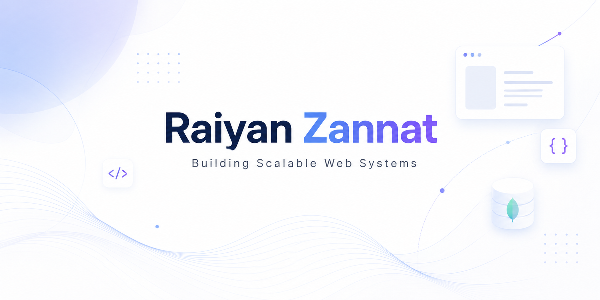

---

## 👋 About Me

Hi! I'm **Raiyan Zannat Oshin** — a Full Stack Developer and M.Sc. student in Computer Science & Engineering at **RUET**, Bangladesh 🇧🇩. I build clean, scalable web applications and love diving deep into both frontend and backend systems.

With a strong foundation in **Data Structures, Algorithms, and OOP**, I combine academic rigor with hands-on development. From crafting responsive UIs to designing REST APIs and wiring up databases — I enjoy owning the full stack.

Outside of code, I'm a **Math Olympiad champion**, a **Spelling Bee competitor**, and a **Scout** who represented Bangladesh internationally. I bring that same competitive discipline to everything I build.

- 🔭 Building **ArenaX** — my latest full stack Next.js project
- 🌱 Exploring **TypeScript** and **Next.js Documentation**
- ⚙️ Working on a **Next.js + Express.js + MongoDB** CRUD application
- 🎯 Goal: Ship production-grade, scalable systems that solve real problems
- 💬 Ask me about **React, JavaScript, Tailwind CSS, or REST APIs**

---

## 🚀 Skills

---

## 📊 GitHub Stats

---

## 🌐 Connect With Me

